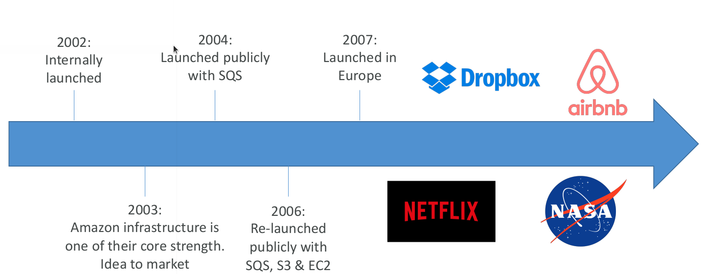
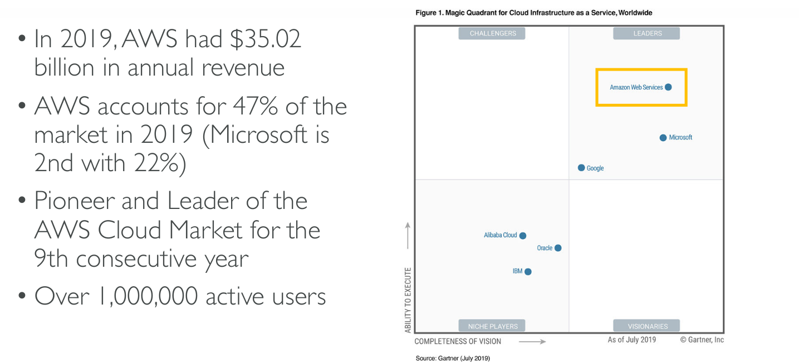

# AWS Cloud Overview

* AWS Regions
* AWS Availability Zones
* AWS Data Centers
* AWS Edge Locations/Points of presence

## AWS Regions

* AWS has Regions all around the world
* Names can be us-east-1, eu-west-3, etc.
* A region is a cluster of data centers
* Most AWS services are region-scoped

## How to choose an AWS Region?

* **Compliance:** with data governance and legal
requirements: data never leaves a region without
your explicit permission
* **Proximity to customers:** reduced latency
* **Available services within a Region:** new services
and new features aren’t available in every Region
* **Pricing:** pricing varies region to region and is
transparent in the service pricing page

## AWS Availability Zones

* Each region has many availability zones
(usually 3, min is 2, max is 6)
* Each availability zone (AZ) is one or more
discrete data centers with redundant power,
networking, and connectivity
* They’re separate from each other, so that
they’re isolated from disasters
* They’re connected with high bandwidth,
ultra-low latency networking

## AWS Points of Presence (Edge Locations)

* Amazon has 216 Points of Presence (205 Edge Locations & 11 Regional
Caches) in 84 cities across 42 countries
* Content is delivered to end users with lower latency
