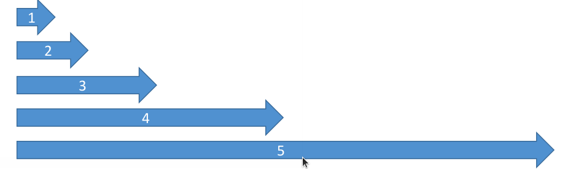

# AWS Limits (Quotas)

* API Rate Limits
  * DescribeInstances API for EC2 has a limit of 100 calls per seconds
  * GetObject on S3 has a limit of 5500 GET per second per prefix
  * For Intermittent Errors: implement Exponential Backoff
  * For Consistent Errors: request an API throttling limit increase
* Service Quotas (Service Limits)
  * Running On-Demand Standard Instances: 1152 vCPU
  * You can request a service limit increase by opening a ticket
  * You can request a service quota increase by using the Service Quotas API

## Exponential Backoff

• If you get ThrottlingException intermittently, use exponential backoff
• Retry mechanism already included in AWS SDK API calls
• Must implement yourself if using the AWS API as-is or in specific cases
  • Must only implement the retries on 5xx server errors and throttling
  • Do not implement on the 4xx client errors

