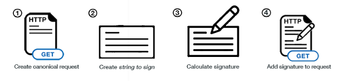

# Signing AWS API requests

* When you call the AWS HTTP API, you sign the request so that AWS can identify you, using your AWS credentials (access key & secret key)
* Note: some requests to Amazon S3 don’t need to be signed
* If you use the SDK or CLI, the HTTP requests are signed for you
* You should sign an AWS HTTP request using Signature v4 (SigV4)

