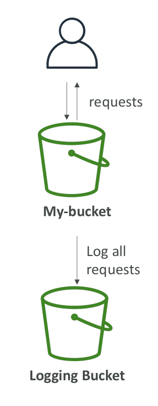
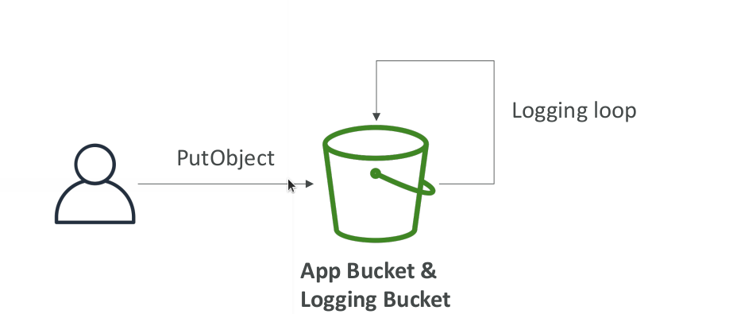

# S3 Access Logs

* For audit purpose, you may want to log all access to S3 buckets
* Any request made to S3, from any account, authorized or denied, will be logged into another S3 bucket
* That data can be analyzed using data analysis tools...
* Or Amazon Athena as we’ll see later in this section!
* The log format is at: `https://docs.aws.amazon.com/AmazonS3/latest/dev/LogFormat.html`

## Warning

* Do not set your logging bucket to be the monitored bucket
* It will create a logging loop, and your bucket will grow in size exponentially

