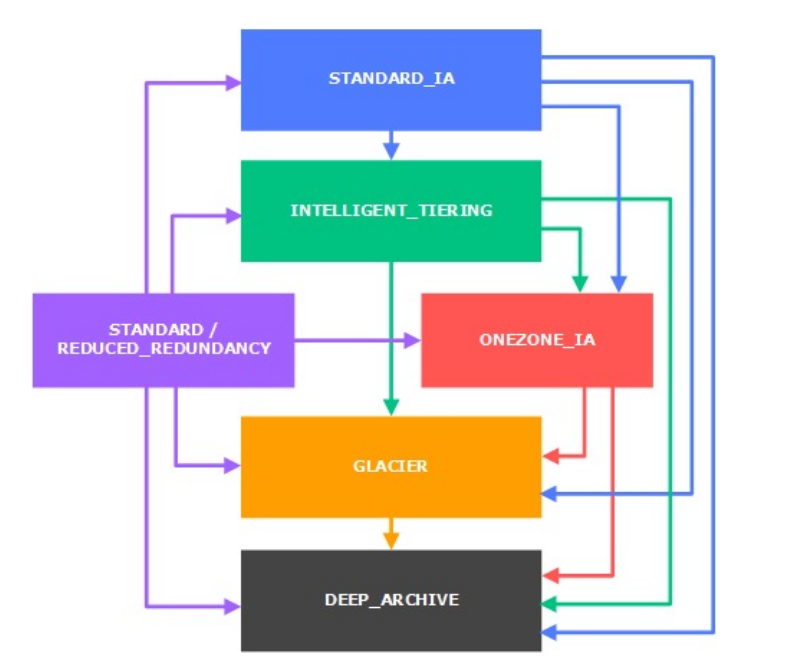

# S3 – Moving between storage classes

* You can transition objects between storage classes
* For infrequently accessed object, move them to STANDARD_IA
* For archive objects you don’t need in real-time, GLACIER or DEEP_ARCHIVE
* Moving objects can be automated using a lifecycle configuration

## Lifecycle Rules

* Transition actions: It defines when objects are transitioned to another storage class.
  * Move objects to Standard IA class 60 days after creation
  * Move to Glacier for archiving after 6 months
* Expiration actions: configure objects to expire (delete) after some time
  * Access log files can be set to delete after a 365 days
  * Can be used to delete old versions of files (if versioning is enabled)
  * Can be used to delete incomplete multi-part uploads
* Rules can be created for a certain prefix (ex - s3://mybucket/mp3/*)
* Rules can be created for certain objects tags (ex - Department: Finance)
