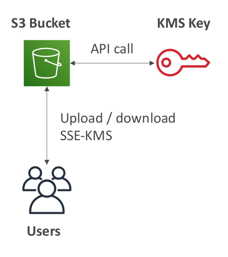
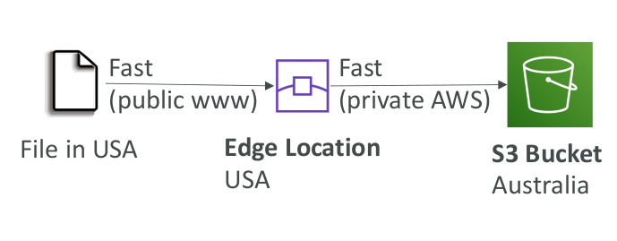
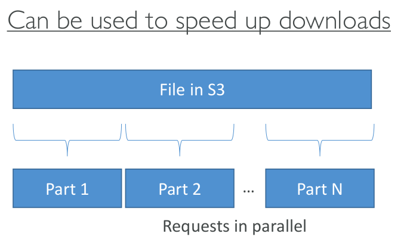
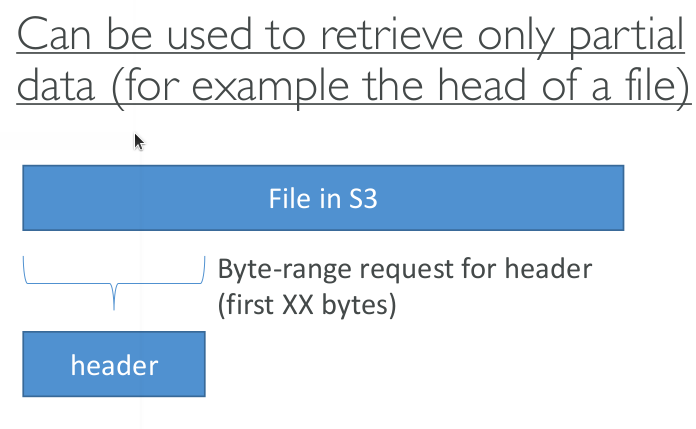

# S3 – Baseline Performance

* Amazon S3 automatically scales to high request rates, latency 100-200 ms
* Your application can achieve at least 3,500 PUT/COPY/POST/DELETE and 5,500 GET/HEAD requests per second per prefix in a bucket.
* There are no limits to the number of prefixes in a bucket.
* Example (object path => prefix):
  * bucket/folder1/sub1/file => /folder1/sub1/
  * bucket/folder1/sub2/file => /folder1/sub2/
  * bucket/1/file => /1/
  * bucket/2/file => /2/
* If you spread reads across all four prefixes evenly, you can achieve 22,000 requests per second for GET and HEAD

## KMS Limitation

* If you use SSE-KMS, you may be impacted by the KMS limits
* When you upload, it calls the GenerateDataKey KMS API
* When you download, it calls the Decrypt KMS API
* Count towards the KMS quota per second (5500, 10000, 30000 req/s based on region)
* You can request a quota increase using the Service Quotas Console

## S3 Performance

* Multi-Part upload:
  * recommended for files > 100MB, must use for files > 5GB
  * Can help parallelize uploads (speed up transfers)

* S3 Transfer Acceleration
  * Increase transfer speed by transferring file to an AWS edge location which will forward the data to the S3 bucket in the target region
  * Compatible with multi-part upload

## S3 Byte-Range Fetches

* Parallelize GETs by requesting specific byte ranges
* Better resilience in case of failures

