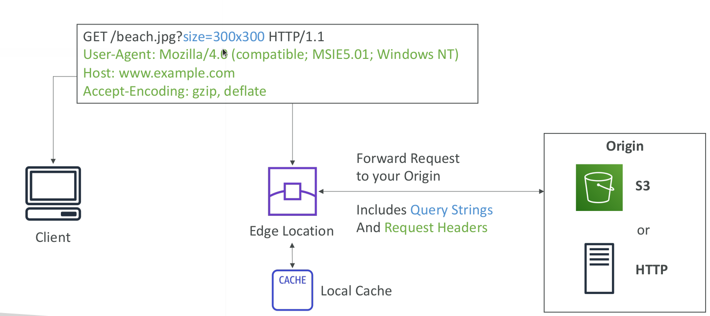

# AWS CloudFront

* Content Delivery Network (CDN)
* Improves read performance, content is cached at the edge
* 216 Point of Presence globally (edge locations)
* DDoS protection, integration with Shield, AWS Web Application Firewall
* Can expose external HTTPS and can talk to internal HTTPS backends

## CloudFront - Origins

* S3 bucket
  * For distributing files and caching them at the edge
  * Enhanced security with CloudFront Origin Access Identity (OAI)
  * CloudFront can be used as an ingress (to upload files to S3)
* Custom Origin (HTTP)
  * Application Load Balancer
  * EC2 instance
  * S3 website (must first enable the bucket as a static S3 website)
  * Any HTTP backend you want

## CloudFront Geo-Restriction

* You can restrict who can access your distribution
  * Whitelist: Allow your users to access your content only if they're in one of the countries on a list of approved countries.
  * Blacklist: Prevent your users from accessing your content if they're in one of the countries on a blacklist of banned countries.
* The "country" is determined using a 3 rd party Geo-IP database
* Use case: Copyright Laws to control access to content

## CloudFront vs S3 Cross Region Replication

* CloudFront:
  * Global Edge network
  * Files are cached for a TTL (maybe a day)
  * Great for static content that must be available everywhere
* S3 Cross Region Replication:
  * Must be setup for each region you want replication to happen
  * Files are updated in near real-time
  * Read only
  * Great for dynamic content that needs to be available at low-latency in few regions
  