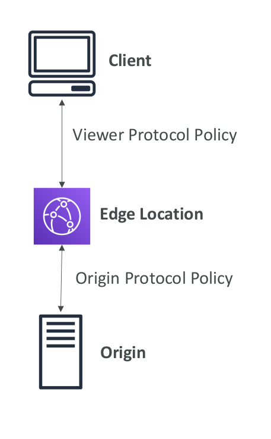

# CloudFront Geo Restriction

* You can restrict who can access your distribution
  * Whitelist: Allow your users to access your content only if they're in one of the countries on a list of approved countries.
  * Blacklist: Prevent your users from accessing your content if they're in one of the countries on a blacklist of banned countries.
* The “country” is determined using a 3 rd party Geo-IP database
* Use case: Copyright Laws to control access to content

## CloudFront and HTTPS

* Viewer Protocol Policy:
  * Redirect HTTP to HTTPS
  * Or use HTTPS only
* Origin Protocol Policy (HTTP or S3):
  * HTTPS only
  * Or Match Viewer (HTTP => HTTP & HTTPS => HTTPS)
* Note:
  * S3 bucket “websites” don’t support HTTPS

