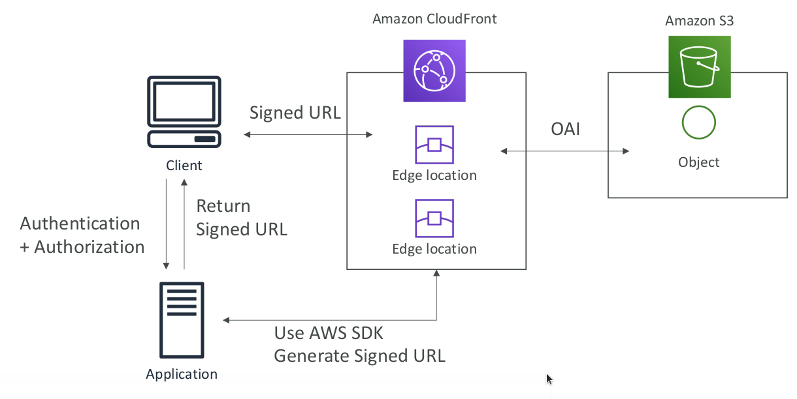
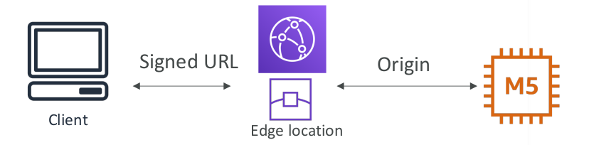
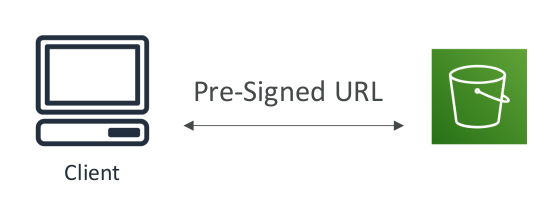

# CloudFront Signed URL / Signed Cookies

* You want to distribute paid shared content to premium users over the world
* To Restrict Viewer Access, we can create a CloudFront Signed URL / Cookie
* How long should the URL be valid for?
  * Shared content (movie, music): make it short (a few minutes)
  * Private content (private to the user): you can make it last for years
* Signed URL = access to individual files (one signed URL per file)
* Signed Cookies = access to multiple files (one signed cookie for many files)

## CloudFront Signed URL vs

* CloudFront Signed URL:
  * Allow access to a path, no matter
  the origin
  * Account wide key-pair, only the root
  can manage it
  * Can filter by IP, path, date, expiration
  * Can leverage caching features

* S3 Pre-Signed URL:
  * Issue a request as the person who
  pre-signed the URL
  * Uses the IAM key of the signing
  IAM principal
  * Limited lifetime

