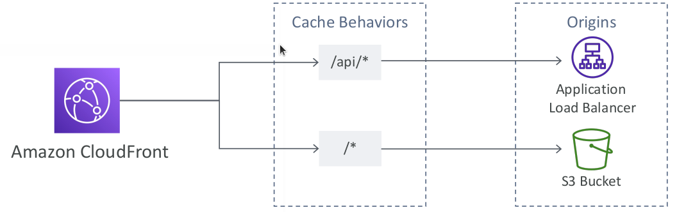

# CloudFront - Pricing

* CloudFront Edge locations are all around the world
* The cost of data out per edge location varies

## Price Classes

* You can reduce the number of edge locations for cost reduction
* Three price classes:
  1. Price Class All: all regions – best performance
  2. Price Class 200: most regions, but excludes the most expensive regions
  3. Price Class 100: only the least expensive regions

## Multiple Origins

* To route to different kind of origins based on the content type
* Based on path pattern:
* `/images/*`
* `/api/*`
* `/*`

## Origin Groups

* To increase high-availability and do failover
* Origin Group: one primary and one secondary origin
* If the primary origin fails, the second one is used

## Field Level Encryption

* Protect user sensitive information through application stack
* Adds an additional layer of security along with HTTPS
* Sensitive information encrypted at the edge close to user
* Uses asymmetric encryption
* Usage:
  * Specify set of fields in POST requests that you want to be encrypted (up to 10 fields)
  * Specify the public key to encrypt them

