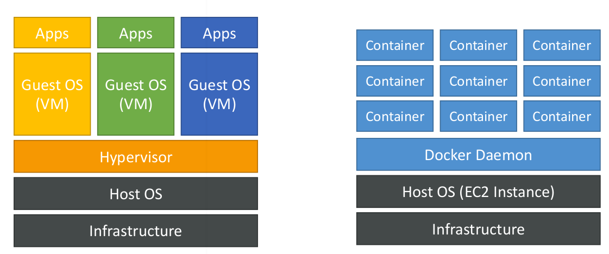

# What is Docker?

* Docker is a software development platform to deploy apps
* Apps are packaged in containers that can be run on any OS
* Apps run the same, regardless of where they’re run
  * Any machine
  * No compatibility issues
  * Predictable behavior
  * Less work
  * Easier to maintain and deploy
  * Works with any language, any OS, any technology

## Where Docker images are stored?

* Docker images are stored in Docker Repositories
* Public: Docker Hub `https://hub.docker.com/`
  * Find base images for many technologies or OS:
  * Ubuntu
  * MySQL
  * NodeJS, Java...
* Private: Amazon ECR (Elastic Container Registry)

## Docker vs Virtual Machines

* Docker is ”sort of ” a virtualization technology, but not exactly
* Resources are shared with the host => many containers on one server

## Docker Containers Management

* To manage containers, we need a container management platform
* Three choices:
  * ECS: Amazon’s own platform
  * Fargate: Amazon’s own Serverless platform
  * EKS: Amazon’s managed Kubernetes (open source)
