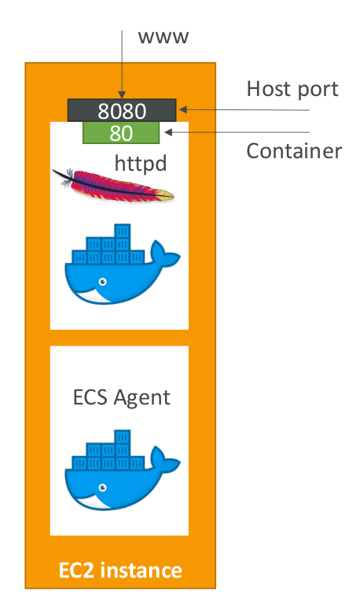

# ECS Task Definitions

* Tasks definitions are metadata in JSON form to tell ECS how to run a Docker Container
* It contains crucial information around:
  * Image Name
  * Port Binding for Container and Host
  * Memory and CPU required
  * Environment variables
  * Networking information
  * IAM Role
  * Logging configuration (ex CloudWatch)

