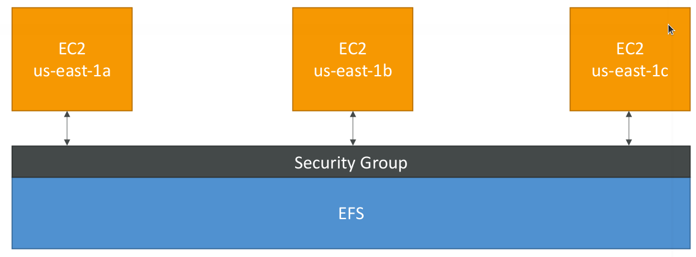

# EFS - Elastic File System

* Managed NFS (network file system) that can be mounted on many EC2
* EFS works with EC2 instances in multi-AZ
* Highly available, scalable, expensive (3x gp2), pay per use

* Use cases: content management, web serving, data sharing, Wordpress
* Uses NFSv4.1 protocol
* Uses security group to control access to EFS
* Compatible with Linux based AMI (not Windows)
* Encryption at rest using KMS
* POSIX file system (~Linux) that has a standard file API
* File system scales automatically, pay-per-use, no capacity planning!

## Performance and Storage Class

* EFS Scale
  * 1000s of concurrent NFS clients, 10 GB+ /s throughput
  * Grow to Petabyte-scale network file system, automatically
* Performance mode (set at EFS creation time)
  * General purpose (default): latency-sensitive use cases (web server, CMS, etc…)
  * Max I/O – higher latency, throughput, highly parallel (big data, media processing)
* Throughput mode
  * Bursting (1 TB = 50MiB/s + burst of up to 100MiB/s)
  * Provisioned: set your throughput regardless of storage size, ex: 1 GiB/s for 1 TB storage
* Storage Tiers (lifecycle management feature – move file after N days)
  * Standard: for frequently accessed files
  * Infrequent access (EFS-IA): cost to retrieve files, lower price to store
  