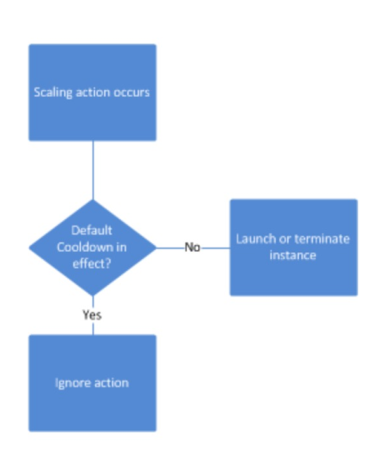

# Scaling Policies

* Target Tracking Scaling
  * Most simple and easy to set-up
  * Example: I want the average ASG CPU to stay at around 40%
* Simple / Step Scaling
  * When a CloudWatch alarm is triggered (example CPU > 70%), then add 2 units
  * When a CloudWatch alarm is triggered (example CPU < 30%), then remove 1
* Scheduled Actions
  * Anticipate a scaling based on known usage patterns
  * Example: increase the min capacity to 10 at 5 pm on Fridays

## Scaling Cooldowns

* The cooldown period helps to ensure that your Auto Scaling group doesn't launch or terminate additional instances before the previous scaling activity takes effect.
* In addition to default cooldown for Auto Scaling group, we can create cooldowns that apply to a specific simple scaling policy
* A scaling-specific cooldown period overrides the default cooldown period.
* One common use for scaling-specific cooldowns is with a scale-in policy—a policy that terminates instances based on a specific criteria or metric. Because this policy terminates instances, Amazon EC2 Auto Scaling needs less time to determine whether to terminate additional instances.
* If the default cooldown period of 300 seconds is too long—you can reduce costs by applying a scaling-specific cooldown period of 180 seconds to the scale-in policy.
* If your application is scaling up and down multiple times each hour, modify the Auto Scaling Groups cool-down timers and the CloudWatch Alarm Period that triggers the scale in

