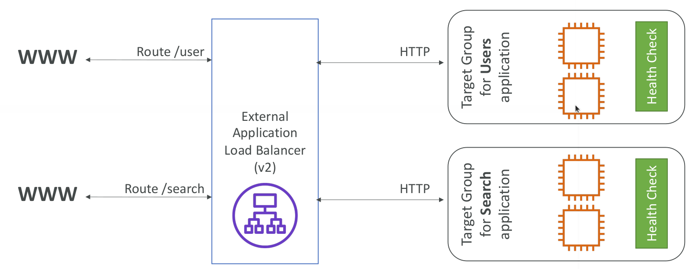
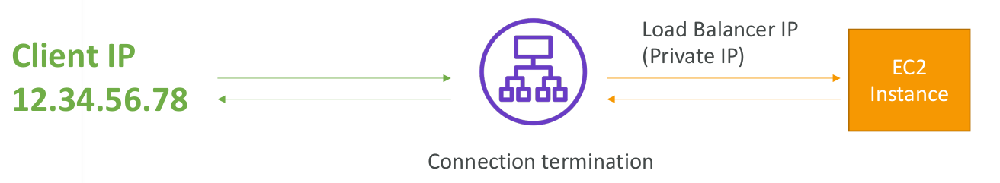

# Application Load Balancer

* Application load balancers is Layer 7 (HTTP)
* Load balancing to multiple HTTP applications across machines (target groups)
* Load balancing to multiple applications on the same machine (ex: containers)
* Support for HTTP/2 and WebSocket
* Support redirects (from HTTP to HTTPS for example)
* Routing tables to different target groups:
  * Routing based on path in URL (example.com/users & example.com/posts)
  * Routing based on hostname in URL (one.example.com & other.example.com)
  * Routing based on Query String, Headers (example.com/users?id=123&order=false)
* ALB are a great fit for micro services & container-based application (example: Docker & Amazon ECS)
* Has a port mapping feature to redirect to a dynamic port in ECS
* In comparison, we’d need multiple Classic Load Balancer per application

## Target Groups

* EC2 instances (can be managed by an Auto Scaling Group) – HTTP
* ECS tasks (managed by ECS itself) – HTTP
* Lambda functions – HTTP request is translated into a JSON event
* IP Addresses – must be private IPs
* ALB can route to multiple target groups
* Health checks are at the target group level

## Good to know

* Fixed hostname (XXX.region.elb.amazonaws.com)
* The application servers don’t see the IP of the client directly
  * The true IP of the client is inserted in the header X-Forwarded-For
  * We can also get Port (X-Forwarded-Port) and proto (X-Forwarded-Proto)

