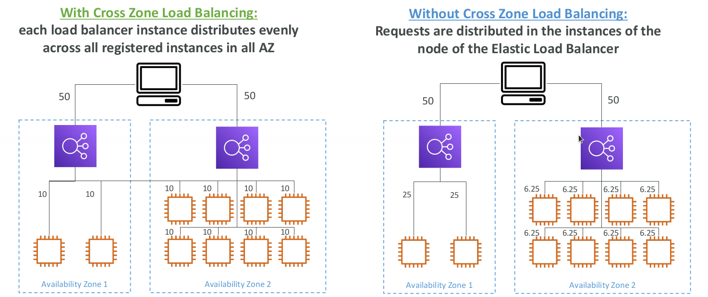

# Cross-Zone Load Balancing

* Application Load Balancer
  * Always on (can’t be disabled)
  * No charges for inter AZ data
* Network Load Balancer
  * Disabled by default
  * You pay charges ($) for inter AZ data if enabled
* Classic Load Balancer
  * Through Console => Enabled by default
  * Through CLI / API => Disabled by default
  * No charges for inter AZ data if enabled
