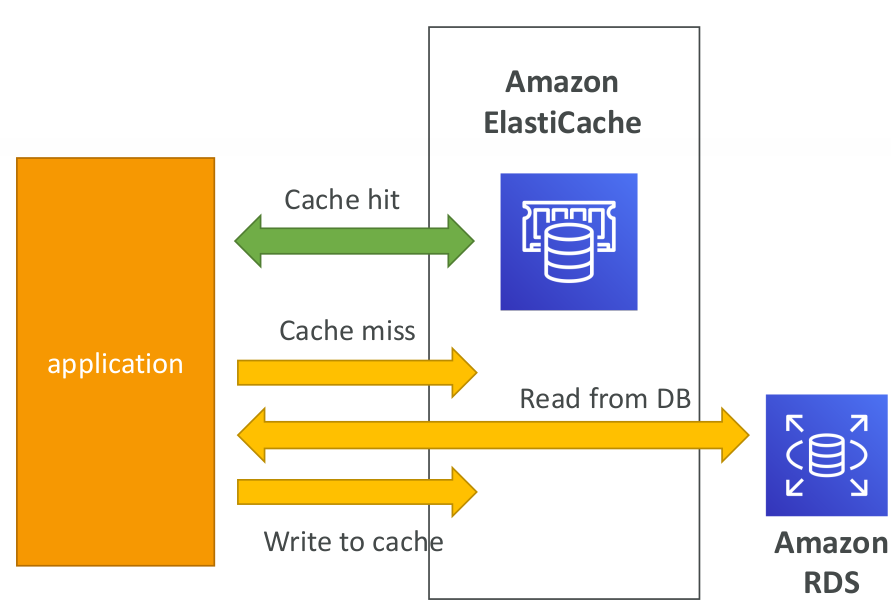
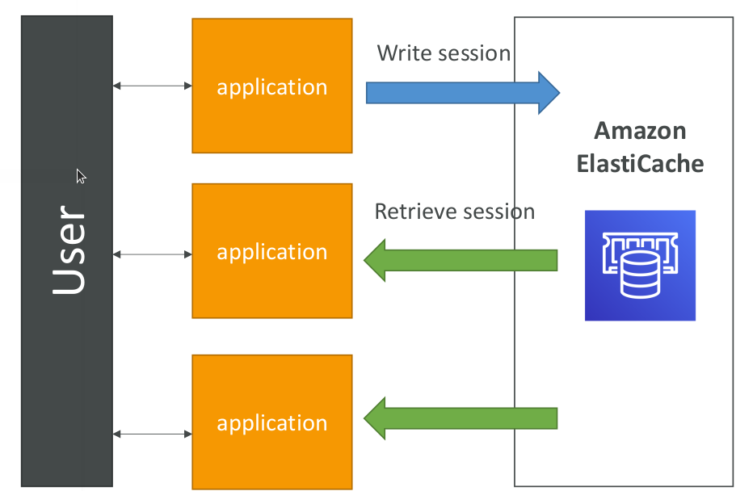
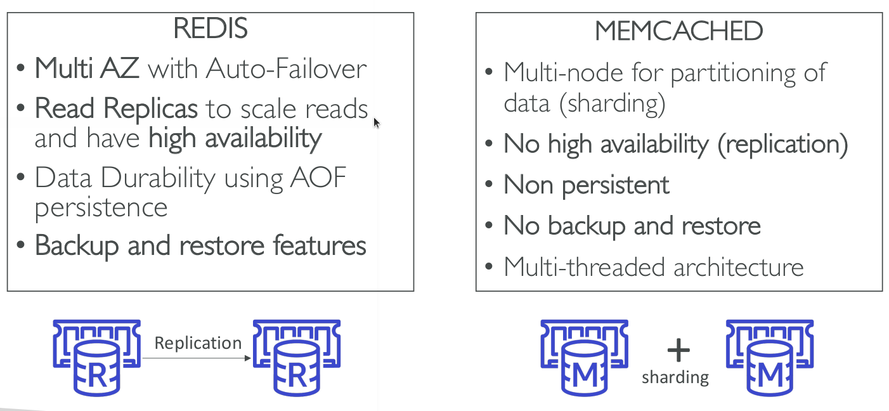

# Amazon ElastiCache Overview

* The same way RDS is to get managed Relational Database...
* ElastiCache is to get managed Redis or Memcached
* Caches are in-memory databases with really high performance, low
latency
* Helps reduce load off of databases for read intensive workloads
* Helps make your application stateless
* AWS takes care of OS maintenance / patching, optimizations, setup, configuration, monitoring, failure recovery and backups
* Using ElastiCache involves heavy application code changes

## DB Cache

* Applications queries ElastiCache, if not available, get from RDS and store in ElastiCache.
* Helps relieve load in RDS
* Cache must have an invalidation strategy to make sure only the most current data is used in there.

## User Session Store

* User logs into any of the application
* The application writes the session data into ElastiCache
* The user hits another instance of our application
* The instance retrieves the data and the user is already logged in

## Redis vs Memcached

