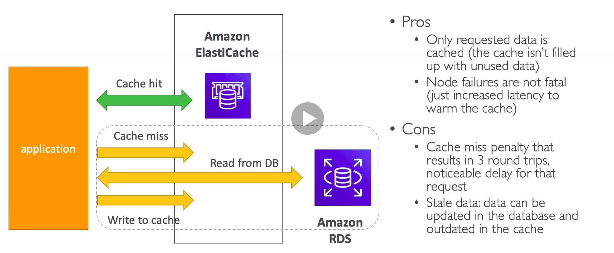
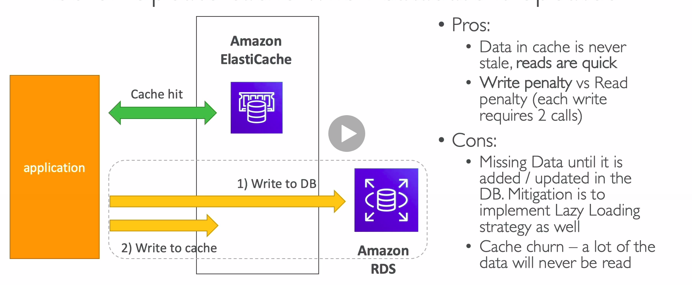

# ElastiCache Implementation Considerations

* Is it safe to cache data? Data may be out of date, eventually consistent
* Is caching effective for that data?
  * Pattern: data changing slowly, few keys are frequently needed
  * Anti patterns: data changing rapidly, all large key space frequently needed
* Is data structured well for caching?
  * example: key value caching, or caching of aggregations results
* Which caching design pattern is the most appropriate?

## Lazy Loading / Cache-Aside / Lazy Population

## Write Through - Add or update cache when database is updated

## Cache Evictions and Time-to-live (TTL)

* Cache eviction can occur in 3 ways
  * You delete the item explicitly in the cache
  * Item is evicted because the memory is full and it's not recently used (LRU)
  * You set an item time-to-live (or TTL)
* TTL are helpful for any kind of data:
  * Leaderbords
  * Comments
  * Activity streams
* TTL can range from few seconds to hours or days
* If yoo many evictions happen due to memory, you should scale up or out

## Final words of wisdom

* Lazy Loading/Cache aside is easy to implement and works for many situations as a foundation, especially on the read side
* Write-through is usually combined with Lazy Loading as targeted for the queries or workloads that benefit from this optimization
* Setting a TTL is usually not a bad idea, except when you are using Write-through. Set it to a sensible value for your application.
* Only cache the data that makes sense (user profiles, blogs, etc...)
