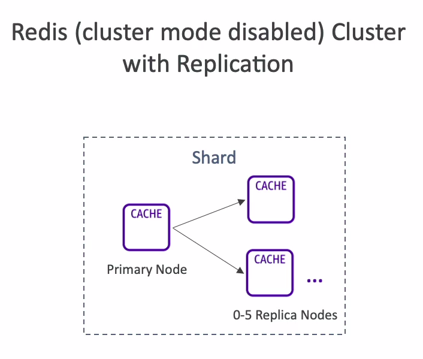
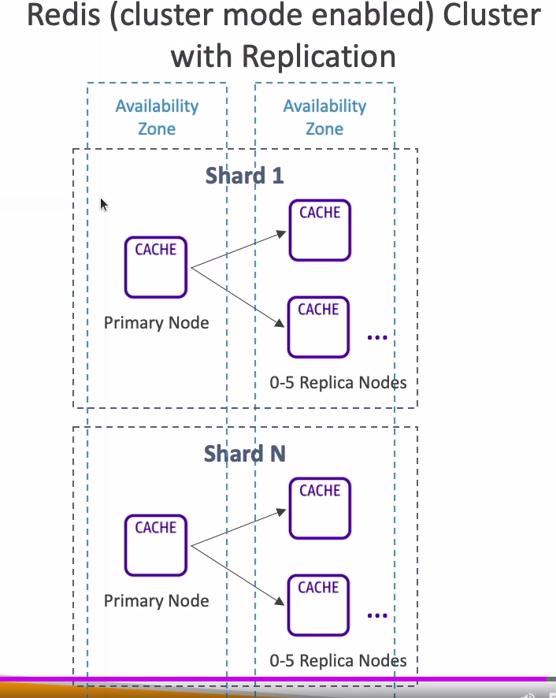

# ElastiCache Redis Cluster Modes

## Cluster Mode Disabled

* One primary node, up to 5 replicas
* Asynchronous Replication
* The primary node is used for read/write
* The other nodes are read-only
* **One shard, all nodes have all the data**
* Guard against data loss if node failure
* Multi-AZ enabled by default for failover

## Cluster Mode Enabled

* Data is partitioned across shards (helpful to scale writes)
* Each shard has a primary and up to 5 replica nodes (same concept as before)
* Multi-AZ capability
* Up to 500 nodes per cluster:
  * 500 shards with single master
  * 250 shards with 1 master and 1 replica

