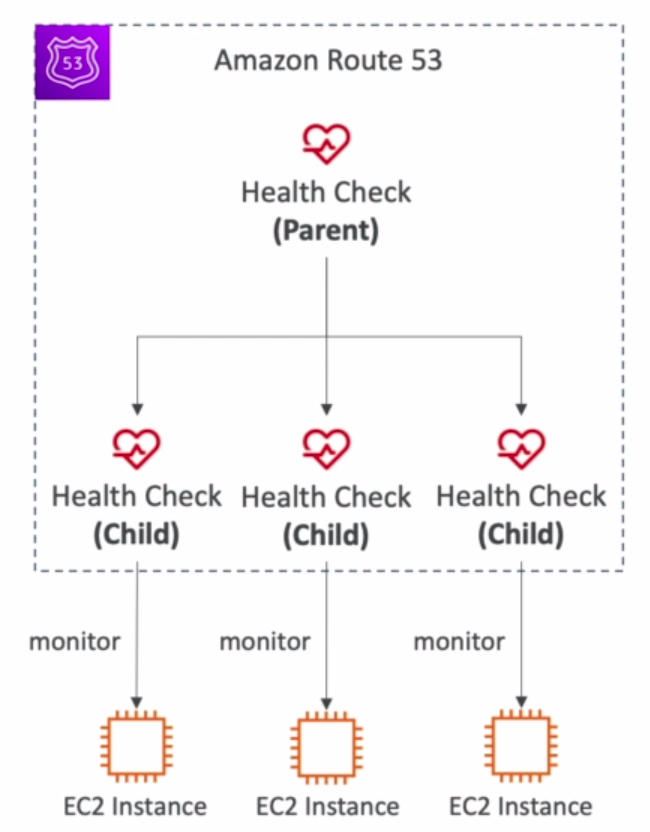

# Health Checks

* HTTP Health Checks are only for public resources
* Health Check => Automated DNS Failover:
  * Health checks that monitor an endpoint (application, server, other AWS resource)
  * Health checks that monitor other health checks (calculated health checks)
  * Health checks that monitor CloudWatch Alarms - e.g. throttles of DynamoDB, alarms on RDS, custom metrics, etc.
* Health Checks are integrated with CW metrics

## Monitor an Endpoint

* About 15 global health checkers will check the endpoint health
  * Healthy/Unhealthy threshold - 3 (default)
  * Interval - 30 sec (can set to 10 sec - higher cost)
  * Supported protocols: HTTP, HTTPS and TCP
  * If > 18% of health checkers report the endpoint is healthy, Route 53 considers it Healthy. Otherwise it's unhealthy.
  * Ability to choose which locations you want Route 53 to use
* Health Checks pass only when the endpoint responds with the 2xx and 3xx status codes
* Health Checks can be setup to pass/fail based on the text in the first 5120 bytes of the response
* Configure your router/firewall to allow incoming requests from Route 53 Health Checkers

## Calculated Health Checks

* Combine the results of multiple Health Checks into a single Health Check
* You can use OR, AND or NOT
* Can monitor up to 256 Child Health Checks
* Specify how many of the health checks need to pass to make the parent pass
* Usage: perform maintenance to your website without causing all health checks to fail

## Private Hosted Zones

* Route 53 health checkers are outside the VPC
* They can't access private endpoints (private VPC or on-premise resource)
* You can create a CloudWatch metric and associate a CloudWatch Alarm, then create a Health Check that checks the alarm itself
