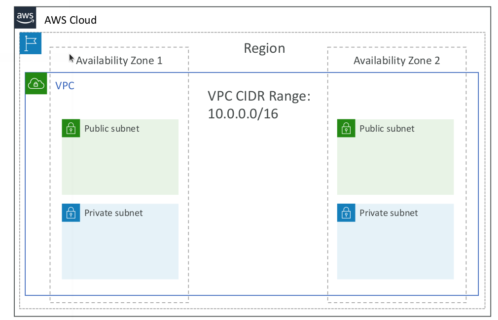

# VPC & Subnets Primer

* VPC: private network to deploy your resources (regional resource)
* Subnets allow you to partition your network inside your VPC (Availability Zone resource)
* A public subnet is a subnet that is accessible from the internet
* A private subnet is a subnet that is not accessible from the internet
* To define access to the internet and between subnets, we use Route Tables

## Internet Gateways and NAT Gateways

* Internet Gateways helps our VPC instances connect with the internet
* Public Subnets have a route to the internet gateway
* NAT Gateways (AWS-managed) & NAT Instances (self-managed) allow your instances in your Private Subnets to access the internet while remaining private

