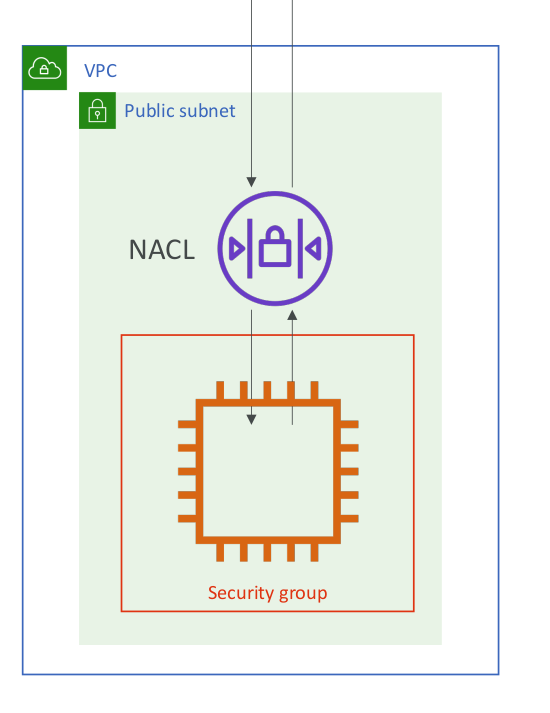
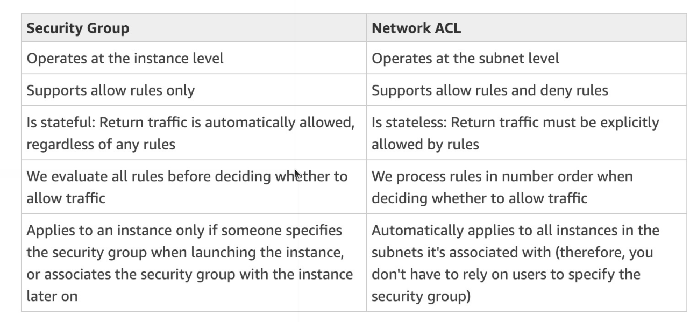

# Network ACL & Security Groups

* NACL (Network ACL)
  * A firewall which controls traffic from and to subnet
  * Can have ALLOW and DENY rules
  * Are attached at the Subnet level
  * Rules only include IP addresses
* Security Groups
  * A firewall that controls traffic to and from an ENI / an EC2 Instance
  * Can have only ALLOW rules
  * Rules include IP addresses and other security groups

## VPC Flow Logs

* Capture information about IP traffic going into your interfaces:
  * VPC Flow Logs
  * Subnet Flow Logs
  * Elastic Network Interface Flow Logs
* Helps to monitor & troubleshoot connectivity issues. Example:
  * Subnets to internet
  * Subnets to subnets
  * Internet to subnets
* Captures network information from AWS managed interfaces too: Elastic Load Balancers, ElastiCache, RDS, Aurora, etc...
* VPC Flow logs data can go to S3 / CloudWatch Logs
