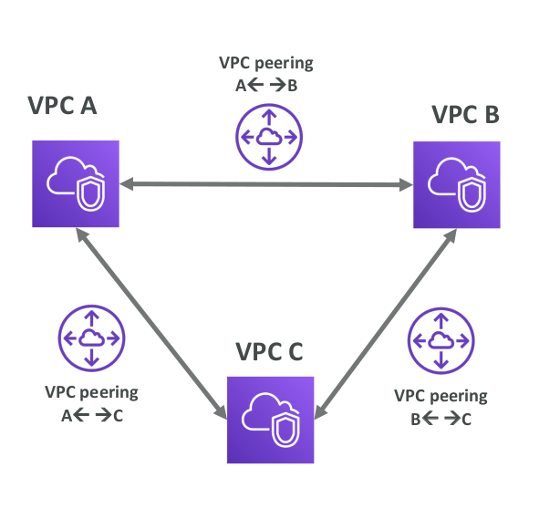
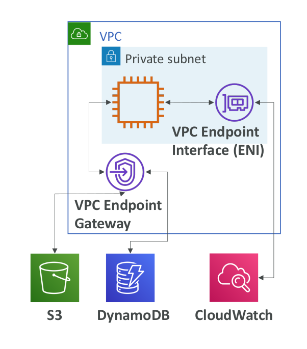
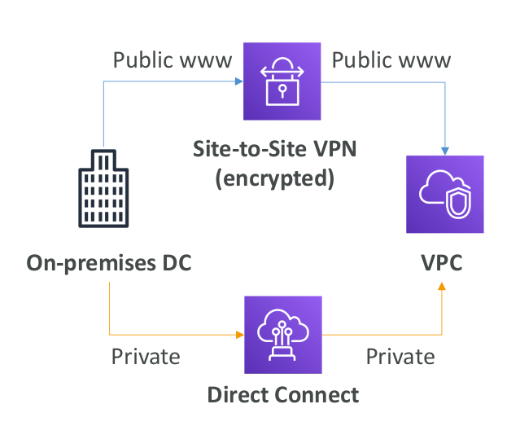

# VPC Peering

* Connect two VPC, privately using AWS’ network
* Make them behave as if they were in the same network
* Must not have overlapping CIDR (IP address range)
* VPC Peering connection is not transitive (must be established for each VPC that need to communicate with one another)

## VPC Endpoints

* Endpoints allow you to connect to AWS Services using a private network instead of the public www network
* This gives you enhanced security and lower latency to access AWS services
* VPC Endpoint Gateway: S3 & DynamoDB
* VPC Endpoint Interface: the rest
* Only used within your VPC

## Site to Site VPN & Direct Connect

* Site to Site VPN
  * Connect an on-premises VPN to AWS
  * The connection is automatically encrypted
  * Goes over the public internet
* Direct Connect (DX)
  * Establish a physical connection between on-
  premises and AWS
  * The connection is private, secure and fast
  * Goes over a private network
  * Takes at least a month to establish
* Note: Site-to-site VPN and Direct Connect cannot access VPC endpoints

