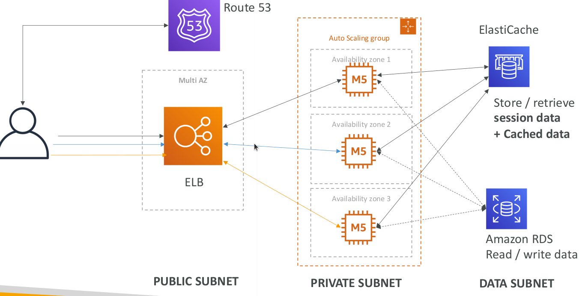
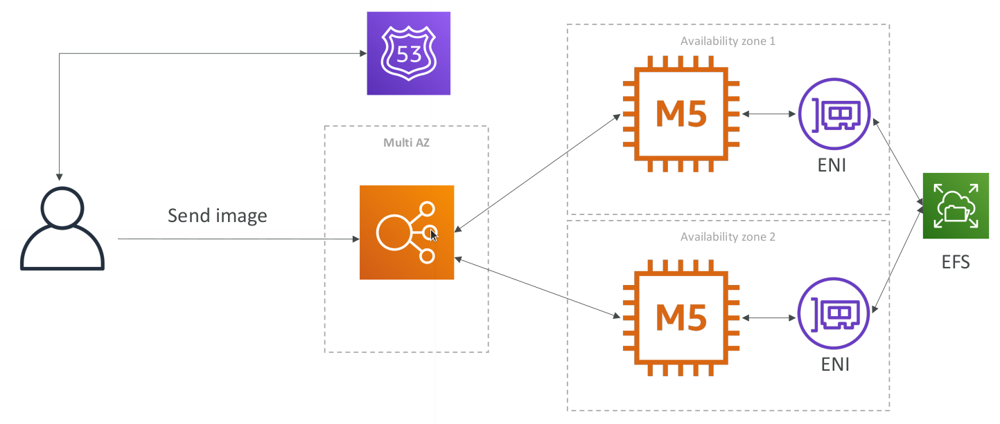

# Typical 3 tier solution architecture

## LAMP Stack on EC2

* Linux: OS for EC2 instances
* Apache: Web Server that run on Linux (EC2)
* MySQL: database on RDS
* PHP: Application logic (running on EC2)
* Can add Redis / Memcached (ElastiCache) to include a caching tech
* To store local application data & software: EBS drive (root)

## WordPress on AWS

