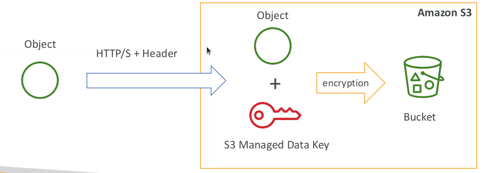

# S3 Encryption for Objects

* There are 4 methods of encrypting objects in S3
  * SSE-S3: encrypts S3 objects using keys handled & managed by AWS
  * SSE-KMS: leverage AWS Key Management Service to manage encryption keys
  * SSE-C: when you want to manage your own encryption keys
  * Client Side Encryption

## SSE-S3

* SSE-S3: encryption using keys handled & managed by Amazon S3
* Object is encrypted server side
* AES-256 encryption type
* Must set header: “x-amz-server-side-encryption": "AES256"

## SSE-KMS

* SSE-KMS: encryption using keys handled & managed by KMS
* KMS Advantages: user control + audit trail
* Object is encrypted server side
* Must set header: “x-amz-server-side-encryption": ”aws:kms"

## SSE-C

* SSE-C: server-side encryption using data keys fully managed by the customer outside of AWS
* Amazon S3 does not store the encryption key you provide
* HTTPS must be used
* Encryption key must provided in HTTP headers, for every HTTP request made

## Client Side Encryption

* Client library such as the Amazon S3 Encryption Client
* Clients must encrypt data themselves before sending to S3
* Clients must decrypt data themselves when retrieving from S3
* Customer fully manages the keys and encryption cycle

## Encryption in transit

* Amazon S3 exposes:
  * HTTP endpoint: non encrypted
  * HTTPS endpoint: encryption in flight
* You’re free to use the endpoint you want, but HTTPS is recommended
* Most clients would use the HTTPS endpoint by default
* HTTPS is mandatory for SSE-C
* Encryption in flight is also called SSL / TLS
