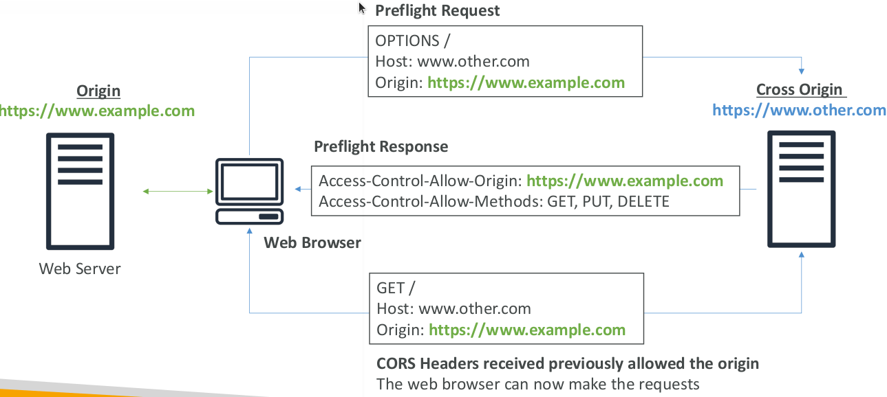
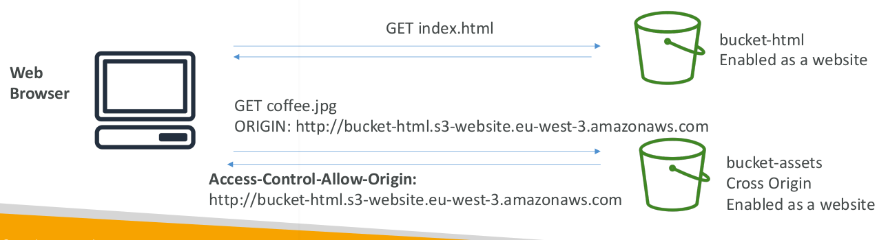

# CORS

* An origin is a scheme (protocol), host (domain) and port
* E.g.: `https://www.example.com` (implied port is 443 for HTTPS, 80 for HTTP)
* CORS means Cross-Origin Resource Sharing
* Web Browser based mechanism to allow requests to other origins while visiting the main origin
* Same origin: `http://example.com/app1` & `http://example.com/app2`
* Different origins: `http://www.example.com` & `http://other.example.com`
* The requests won’t be fulfilled unless the other origin allows for the requests, using CORS Headers (ex: Access-Control-Allow-Origin)

## S3 CORS

* If a client does a cross-origin request on our S3 bucket, we need to enable the correct CORS headers
* It’s a popular exam question
* You can allow for a specific origin or for * (all origins)

