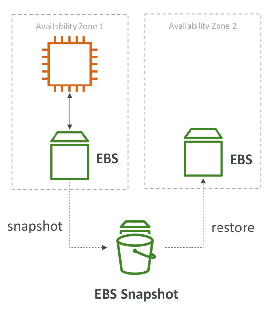
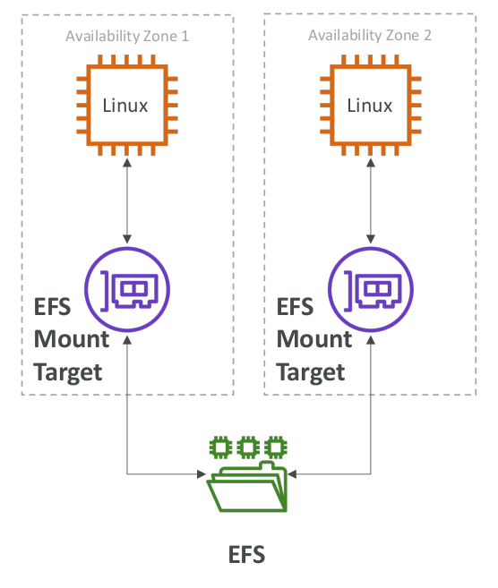

# EFS vs EBS

## EBS

* EBS volumes…
  * can be attached to only one instance at a time
  * are locked at the Availability Zone (AZ) level
  * gp2: IO increases if the disk size increases
  * io1: can increase IO independently
* To migrate an EBS volume across AZ
  * Take a snapshot
  * Restore the snapshot to another AZ
  * EBS backups use IO and you shouldn’t run them while your application is handling a lot of traffic
* Root EBS Volumes of instances get terminated by default if the EC2 instance gets terminated (you can disable that)

## EFS

* Mounting 100s of instances across AZ
* EFS share website files (WordPress)
* Only for Linux Instances (POSIX)
* EFS has a higher price point than EBS
* Can leverage EFS-IA for cost savings

