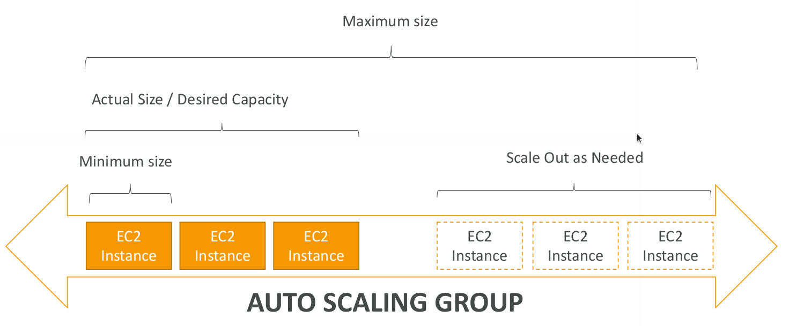
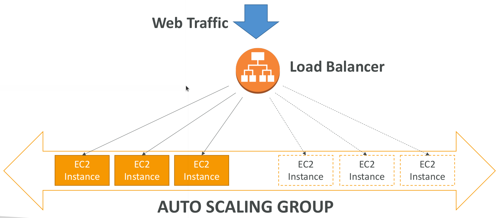

# Auto Scaling Group Overview

* In real-life, the load on your websites and application can change
* In the cloud, you can create and get rid of servers very quickly
* The goal of an Auto Scaling Group (ASG) is to:
  * Scale out (add EC2 instances) to match an increased load
  * Scale in (remove EC2 instances) to match a decreased load
  * Ensure we have a minimum and a maximum number of machines running
  * Automatically Register new instances to a load balancer

## ASG Attributes

* A launch configuration
  * AMI + Instance Type
  * EC2 User Data
  * EBS Volumes
  * Security Groups
  * SSH Key Pair
* Min Size / Max Size / Initial Capacity
* Network + Subnets Information
* Load Balancer Information
* Scaling Policies

## Auto Scaling Alarms

* It is possible to scale an ASG based on CloudWatch alarms
* An Alarm monitors a metric (such as Average CPU)
* Metrics are computed for the overall ASG instances
* Based on the alarm:
  * We can create scale-out policies (increase the number of instances)
  * We can create scale-in policies (decrease the number of instances)

## Auto Scaling New Rules

* It is now possible to define ”better” auto scaling rules that are directly managed by EC2
  * Target Average CPU Usage
  * Number of requests on the ELB per instance
  * Average Network In
  * Average Network Out
* These rules are easier to set up and can make more sense

## Auto Scaling Custom Metric

* We can auto scale based on a custom metric (ex: number of connected users)
* 1. Send custom metric from application on EC2 to CloudWatch (PutMetric API)
* 2. Create CloudWatch alarm to react to low / high values
* 3. Use the CloudWatch alarm as the scaling policy for ASG

## ASG Brain Dump

* Scaling policies can be on CPU, Network… and can even be on custom metrics or based on a schedule (if you know your visitors patterns)
* ASGs use Launch configurations or Launch Templates (newer)
* To update an ASG, you must provide a new launch configuration / launch template
* IAM roles attached to an ASG will get assigned to EC2 instances
* ASG are free. You pay for the underlying resources being launched
* Having instances under an ASG means that if they get terminated for whatever reason, the ASG will automatically create new ones as a replacement. Extra safety!
* ASG can terminate instances marked as unhealthy by an LB (and hence replace them)
