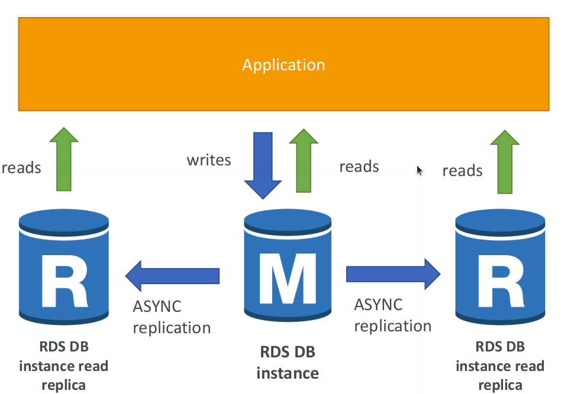
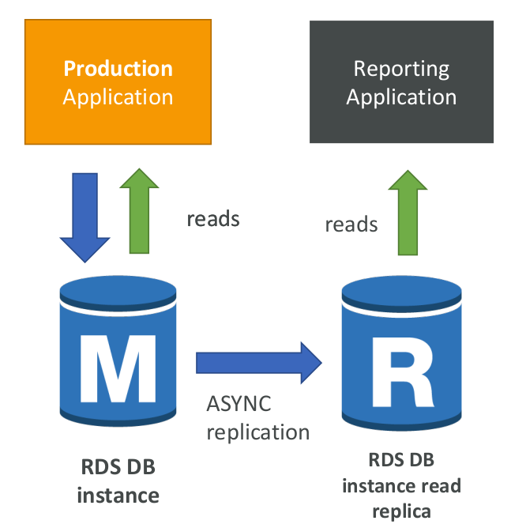
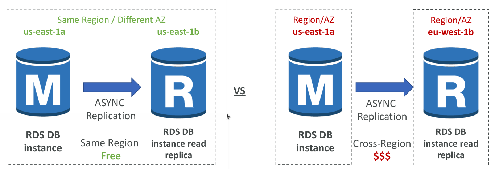
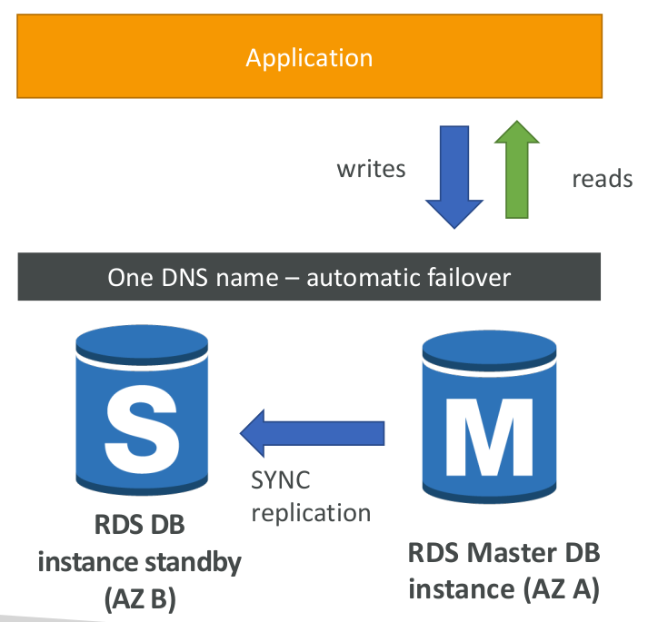
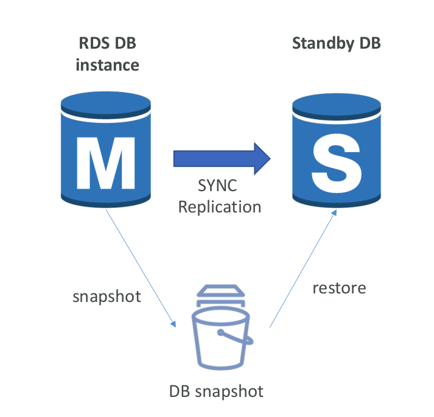

# RDS Read Replicas for read scalability

* Up to 5 Read Replicas
* Within AZ, Cross AZ or Cross Region
* Replication is ASYNC, so reads are eventually consistent
* Replicas can be promoted to their own DB
* Applications must update the connection string to leverage read replicas

## Read Replicas Use Cases

• You have a production database that is taking on normal load
• You want to run a reporting application to run some analytics
• You create a Read Replica to run the new workload there
• The production application is unaffected
• Read replicas are used for SELECT (=read) only kind of statements (not INSERT, UPDATE, DELETE)

## Read Replicas Network Cost

* In AWS there’s a network cost when data goes from one AZ to another
* For RDS Read Replicas within the same region, you don’t pay that fee

## RDS Multi AZ (Disaster Recovery)

* SYNC replication
* One DNS name – automatic app failover to standby
* Increase availability
* Failover in case of loss of AZ, loss of network, instance or storage failure
* No manual intervention in apps
* Not used for scaling
* Multi-AZ replication is free
* Note:The Read Replicas be setup as Multi AZ for Disaster Recovery (DR)

## From Single-AZ to Multi-AZ

* Zero downtime operation (no need to stop the DB)
* Just click on “modify” for the database
* The following happens internally:
* A snapshot is taken
* A new DB is restored from the snapshot in a new AZ
* Synchronization is established between the two databases

