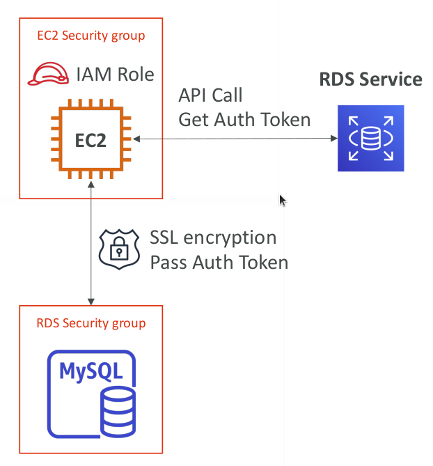

# RDS Security + Encryption

* At rest encryption
  * Possibility to encrypt the master & read replicas with AWS KMS - AES-256 encryption
  * Encryption has to be defined at launch time
  * If the master is not encrypted, the read replicas cannot be encrypted
  * Transparent Data Encryption (TDE) available for Oracle and SQL Server

* In-flight encryption
  * SSL certificates to encrypt data to RDS in flight
  * Provide SSL options with trust certificate when connecting to database
* To enforce SSL:
  * PostgreSQL: `rds.force_ssl=1` in the AWS RDS Console (Parameter Groups)
  * MySQL: Within the DB: `GRANT USAGE ON *.* TO 'mysqluser'@'%' REQUIRE SSL;`

## RDS Encryption Operations

* Encrypting RDS backups
  * Snapshots of un-encrypted RDS databases are un-encrypted
  * Snapshots of encrypted RDS databases are encrypted
  * Can copy a snapshot into an encrypted one
* To encrypt an un-encrypted RDS database:
  * Create a snapshot of the un-encrypted database
  * Copy the snapshot and enable encryption for the snapshot
  * Restore the database from the encrypted snapshot
  * Migrate applications to the new database, and delete the old database

## RDS Security - Network & IAM

* Network Security
  * RDS databases are usually deployed within a private subnet, not in a public one
  * RDS security works by leveraging security groups (the same concept as for EC2 instances) – it controls which IP / security group can communicate with RDS
* Access Management
  * IAM policies help control who can manage AWS RDS (through the RDS API)
  * Traditional Username and Password can be used to login into the database
  * IAM-based authentication can be used to login into RDS MySQL & PostgreSQL

## RDS - IAM Authentication

* IAM database authentication works with MySQL and PostgreSQL
* You don’t need a password, just an authentication token obtained through IAM & RDS API calls
* Auth token has a lifetime of 15 minutes
* Benefits:
  * Network in/out must be encrypted using SSL
  * IAM to centrally manage users instead of DB
  * Can leverage IAM Roles and EC2 Instance profiles for easy integration

## RDS Security - Summary

* Encryption at rest:
  * Is done only when you first create the DB instance
  * or: unencrypted DB => snapshot => copy snapshot as encrypted => create DB from snapshot
* Your responsibility:
  * Check the ports / IP / security group inbound rules in DB’s SG
  * In-database user creation and permissions or manage through IAM
  * Creating a database with or without public access
  * Ensure parameter groups or DB is configured to only allow SSL connections
* AWS responsibility:
  * No SSH access
  * No manual DB patching
  * No manual OS patching
  * No way to audit the underlying instance
